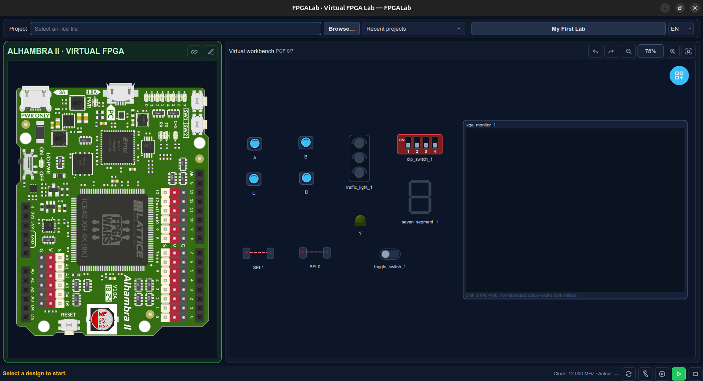

# FPGALab

FPGALab is an interactive virtual FPGA laboratory for Verilog designs. It turns an Icestudio export into a native Verilator model and connects that model to a PyQt6 desktop interface, so learners can interact with a virtual board and peripherals without requiring physical hardware.

The first supported board is **Alhambra II**. Boards, workbench parts, and their visual renderers are separated from the simulation engine so the platform can grow without coupling every peripheral to the core application.

## Screenshot



## What it does

- Opens an Icestudio `.ice` design and finds its generated `main.v` and PCF file in `ice-build`.
- Builds the design with Verilator only when the HDL, PCF, profile, or build settings have changed.
- Runs the compiled model through a native C ABI and Python `ctypes`, without VCD-based interaction.
- Emulates a configurable virtual clock (12 MHz by default) while refreshing the GUI at a human-friendly rate.
- Maps Alhambra II LEDs, switches, reset, and GPIO endpoints through the design PCF.
- Provides a reusable laboratory workspace with LEDs, momentary buttons, toggle and DIP switches, a vehicle-presence sensor, traffic lights, seven-segment and BCD displays, and VGA monitors.
- Supports multiple selection, group movement, duplication, deletion, undo/redo, zoom, panning, and fitting all components in the workbench.
- Keeps physical board artwork and interactive element placement in SVG and JSON assets.
- Offers an English interface by default, with Spanish available from the `EN / ES` language selector.

## Architecture

```text
Icestudio design (.ice)
        │
        ├── ice-build/<design>/main.v
        └── ice-build/<design>/main.pcf
        │
        ▼
Project discovery + VerilogInterface + BoardProfile
        │                              │
        │                              └── PCF maps HDL nets to board endpoints
        ▼
Verilator build cache ──► generated C++ wrapper + native capture code
        │
        ▼
Per-design shared library (.so / .dll / .dylib)
        │
        ▼
ctypes VerilatorSimulation
        │
        ▼
SimulationWorker (QThread + QTimer)
        │
        ├── BoardView
        │     └── board LEDs, switches, reset, SVG layout
        │
        └── Peripheral catalog + virtual workbench
              │
              ├── gpio_driven       → buttons, switches and sensors drive FPGA inputs
              ├── gpio_sampled      → BCD display reads the current FPGA outputs
              ├── gpio_temporal     → LED, traffic light, display brightness
              └── streaming_sink    → cycle-accurate VGA frame capture
                    ▲
                    │
       lab JSON: terminal → board endpoint → FPGA pin → PCF HDL net
```

The C++ wrapper exposes native getters, setters, clock stepping, batched cycle execution, temporal predicates, and streaming hooks. Python sends inputs to the model and receives compact frame summaries; the GUI never has to refresh at the FPGA clock rate.

## Requirements

- Python 3.10 or newer
- [Verilator](https://www.veripool.org/verilator/) 5.x or newer
- A C++17 compiler and GNU Make-compatible build tools
  - Linux: GCC or Clang with `make`
  - Windows: MSYS2/MinGW64 is recommended
  - macOS: Xcode Command Line Tools (`xcode-select --install`)
- PyQt6 (installed automatically with the Python package)

### Simulation toolchain

FPGALab resolves Verilator in this order: the toolchain installed by Apio/Icestudio, a standalone OSS CAD Suite configured with `FPGALAB_OSS_CAD_SUITE`, and finally `verilator` on the system `PATH`. Common locations include `%USERPROFILE%\.icestudio\apio\packages\oss-cad-suite` on Windows and `~/.apio/packages/oss-cad-suite` on Linux and macOS. The historical `tools-oss-cad-suite` package name is also supported.

Some Icestudio installations store their packages under `AppData` or another custom location. In that case, set `FPGALAB_OSS_CAD_SUITE` to the directory containing the suite's `bin` and `share` folders. Use `MSYS2_ROOT` as well when MSYS2 is not installed at the standard `C:\msys64` location. An explicit `FPGALAB_VERILATOR` setting can point directly to a Verilator executable.

OSS CAD Suite is recommended for a portable toolchain installation, but generated Verilator models still require GNU Make-compatible build tools and a C++17 compiler. On Windows, install MSYS2 and run the following command in an MSYS2 UCRT64 terminal; FPGALab detects the standard `C:\msys64` installation automatically.

```bash
pacman -S --needed make python mingw-w64-ucrt-x86_64-gcc
```

On macOS, install Apple's command-line build tools and Verilator before running a design. Homebrew is one supported way to install Verilator:

```bash
xcode-select --install
brew install verilator
verilator --version
```

```bash
# Linux/macOS example
export FPGALAB_OSS_CAD_SUITE=/path/to/oss-cad-suite
fpga-lab
```

## Installation

Prebuilt packages for Linux, Windows, and macOS are available from [GitHub Releases](https://github.com/lmcapacho/FPGALab/releases). Extract the downloaded package completely before starting FPGALab.

To install the current source version:

```bash
git clone https://github.com/lmcapacho/FPGALab.git
cd FPGALab

python -m venv .venv
source .venv/bin/activate       # Windows PowerShell: .venv\Scripts\Activate.ps1
pip install -e .

verilator --version
```

## Run FPGALab

Start the desktop application:

```bash
fpga-lab
```

Or open an Icestudio design directly:

```bash
fpga-lab --ice /path/to/design.ice
```

Use the top bar to select a design, select or create a laboratory, and start the simulation. The Run and Stop controls are located at the bottom-right of the application window.

### Icestudio workflow

1. Create or open a design in Icestudio.
2. Generate the Verilog output so that Icestudio produces `ice-build/<design>/main.v` and its PCF file.
3. Open the `.ice` file in FPGALab.
4. Press Run. FPGALab automatically determines whether the cached native model can be reused or needs rebuilding.
5. Interact with the board and peripherals while the model is running.

FPGALab does not write Verilator artifacts into `ice-build`. Compiled models are stored in the user cache.

### Workbench controls

Use the floating catalog button to add peripherals. Drag empty space to select several components, and drag a selected component to move the group. The mouse wheel controls zoom; `Ctrl`+drag or middle-button drag pans the workbench. The toolbar provides undo, redo, 100% zoom, and fit-to-content actions. `Ctrl+D` duplicates the selection and `Delete` removes it.

## Virtual time and visual refresh

The virtual FPGA advances according to elapsed host time and the configured FPGA clock (12 MHz by default). The native wrapper batches many FPGA cycles in C++ for each visual frame, avoiding a Python-to-C boundary crossing per cycle.

The Simulation Settings button in the bottom toolbar configures the virtual FPGA clock, interface refresh rate (60 Hz by default), and temporal sampling rate (1 MHz by default). These preferences are stored in the platform's standard FPGALab user settings and apply on the next run. External temporal peripherals define output predicates in their manifests; the native engine samples them at the configured temporal rate and delivers duty cycle, transition count, and final state to the GUI for each visual frame. Select a temporal rate equal to the FPGA clock when an experiment requires cycle-level observation; lower rates reduce instrumentation cost while remaining well above human-visible frequencies.

This lets a visual LED or seven-segment display show slow blinking, PWM brightness, and multiplexing without making Qt run at 12 MHz. A display common can be tied to `GND` or `VCC`, or driven by an FPGA pin for multiplexed designs.

If the host cannot sustain the requested virtual frequency, select a lower FPGA clock in Simulation Settings.

VGA 640×480 labs should use a virtual clock near 25 MHz. FPGALab does not change the clock automatically and warns when a VGA monitor is used with the 12 MHz Alhambra default. The catalog provides 1-bit, 6-bit, and 12-bit VGA monitors.

## Board mapping and GPIO

For Icestudio projects, the PCF is used to relate generated HDL net names to physical Alhambra II endpoints. This allows board LEDs and switches to work even when Icestudio-generated signal names differ from labels such as `LED0` or `SW1`.

External peripherals are configured from the virtual workbench. Their terminals are assigned to board GPIO endpoints, and FPGALab resolves those endpoints through the PCF when the HDL connects them. A peripheral may remain physically connected even if the current HDL does not use that pin.

## Laboratories

Laboratories are reusable configurations independent from Icestudio project folders. They store external peripherals, settings, pin assignments, positions, and the workbench zoom and camera position.

Default locations are:

- Linux: `~/FPGALab/labs`
- macOS: `~/FPGALab/labs`
- Windows: `Documents/FPGALab/labs`

Set `FPGALAB_WORKSPACE` to use a different workspace root.

The most recently selected lab is remembered in the platform's standard FPGALab user settings and is restored when the application starts.

Use **Import…** and **Export…** in the Lab manager to share portable `*.lab` files. Their content is JSON, but the user-facing extension is simply `.lab`. Existing `*.lab.json` files remain supported. An imported Lab is validated and copied into the local workspace without overwriting an existing Lab. Lab files contain no machine-specific paths, so they can be shared alongside the corresponding Icestudio `.ice` design.

## Catalog, board assets, and extensibility

Peripheral definitions live in a bundled catalog:

```text
fpga_lab/peripherals/<peripheral-id>/manifest.json
fpga_lab/peripherals/<peripheral-id>/icon.svg
fpga_lab/peripherals/renderers/<renderer>.py
```

The manifest declares terminals, directions, configuration properties, simulation class, visual renderer, category, description, search keywords, and catalog icon. The searchable catalog and generic configuration dialog are built from this metadata. The current release discovers peripherals bundled with FPGALab; loading user-installed catalogs is planned for a later version.

The current simulation classes are:

| Class | Purpose |
| --- | --- |
| `gpio_driven` | A workbench control drives an FPGA input, for example a button or sensor. |
| `gpio_sampled` | A peripheral reads the current FPGA output values, for example the BCD display. |
| `gpio_temporal` | An FPGA output is evaluated over virtual time, for example an LED, traffic light, or seven-segment display. |
| `streaming_sink` | A native C++ sink consumes every virtual clock edge, currently used for VGA capture. |

A board is described by reusable assets:

- `fpga_lab/assets/boards/alhambra_ii.svg` — scalable board artwork
- `fpga_lab/assets/board_layouts/alhambra_ii.json` — interactive controls, geometry, colours, and HDL signals
- `fpga_lab/assets/board_definitions/alhambra_ii.json` — physical endpoints and board capabilities

This separation makes it possible to calibrate controls visually, add new integrated controls, add a catalog peripheral, or introduce another FPGA board without changing the core simulation loop.

## Updates

FPGALab checks GitHub Releases shortly after startup without interrupting the workflow. The update button in the status bar runs a manual check. When a newer compatible release is available, FPGALab offers to open its GitHub release page, where the platform package can be downloaded.

Release candidates are considered while running a release candidate build. Stable builds only check stable releases.

### Windows release assets

Windows releases provide two options: `windows-x64.exe` is a self-contained executable and is the recommended download; `windows-x64-portable.zip` contains an application folder and must be fully extracted before starting `FPGALab.exe`. Do not run the executable from Windows Explorer's compressed-folder view, because `_internal` dependencies are not available there.

Windows SmartScreen may display an `Unknown publisher` warning until the application is Authenticode-signed and builds reputation. This is independent from the application package contents.

### macOS release assets

macOS releases provide separate `macos-x86_64.zip` (Intel) and `macos-arm64.zip` (Apple Silicon) application bundles. Extract the ZIP completely before opening `FPGALab.app`. Builds are ad-hoc signed for integrity but are not Apple-notarized yet, so macOS may require using **Open** from the context menu on first launch. The bundled application includes Python and PyQt6; Verilator and the Xcode Command Line Tools are still required to compile Icestudio designs.

## Command-line options

```text
--ice PATH                 Icestudio design to open
--library PATH             Prebuilt simulation library (advanced mode)
--profile PATH             Manual board profile (advanced mode)
--cache-dir PATH           Override the Verilator build cache
--clock-hz INTEGER         Override the saved virtual clock for this launch
--ui-refresh-hz INTEGER    Override the saved GUI refresh rate for this launch
--observation-hz INTEGER   Override the saved sampling rate for this launch
```

## Project status

FPGALab is under active development. Alhambra II is currently the only officially supported board. Simulation still requires an external Verilator toolchain and native build tools. Windows packages are not Authenticode-signed and macOS packages are not Apple-notarized. The virtual frequency that can be sustained depends on the host computer and the complexity of the simulated design and Lab.

## License

This project is licensed under the [GNU Affero General Public License v3.0](LICENSE).
