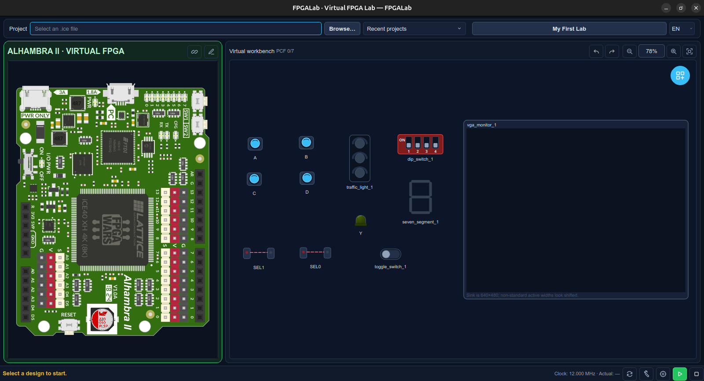

# FPGALab

[](https://github.com/lmcapacho/FPGALab/actions/workflows/ci.yml)

FPGALab is a desktop virtual FPGA laboratory for Icestudio and Verilog designs. It compiles an Icestudio-generated design with Verilator, then lets you interact with a virtual board and peripherals—LEDs, buttons, displays, sensors, VGA, and more—without physical hardware. It is designed for learning and experimentation.



The first officially supported board is **Alhambra II**. You can create and share Labs with different peripheral arrangements, install declarative peripheral packages, and switch between English and Spanish. Simulation requires an external Verilator toolchain and native build tools; the virtual clock speed achievable depends on your computer and design.

## What you can do

- Simulate an Icestudio design with its board controls and connected peripherals, without uploading to hardware.
- Arrange LEDs, switches, sensors, displays, and VGA monitors on a zoomable workbench.
- Save a Lab separately from the design and import or export it as a portable `.lab` file to share with others.
- Install additional declarative peripherals from a folder or ZIP package without changing FPGALab itself.
- Reuse compiled models when the design and relevant build inputs have not changed.

FPGALab uses virtual FPGA time for simulation and a separate, slower refresh rate for the interface. The status bar reports the speed your computer actually achieves.

## Get started

1. Download FPGALab for Linux, Windows, or macOS from [GitHub Releases](https://github.com/lmcapacho/FPGALab/releases) and extract the package completely if it is an archive.
2. Install or locate Verilator 5+, GNU Make-compatible tools, and a C++17 compiler. See the [toolchain guide](https://lmcapacho.github.io/FPGALab/en/troubleshooting/) for platform-specific instructions.
3. Open a design in Icestudio and generate its Verilog output (`main.v` and a PCF or XDC pin-constraint file).
4. Open the `.ice` file in FPGALab, select or create a Lab, and press **Run**. The first run compiles the model; later runs reuse the build cache when possible.
5. Add peripherals from the floating catalog and connect their terminals to board pins. Press **Stop** before changing the design, board, or Lab.

For installation details and the full first-run workflow, see [Getting started](https://lmcapacho.github.io/FPGALab/en/getting-started/) or [Primeros pasos](https://lmcapacho.github.io/FPGALab/es/getting-started/).

### Run from source

Requires Python 3.10 or newer in addition to the simulation toolchain:

```bash
git clone https://github.com/lmcapacho/FPGALab.git
cd FPGALab
python -m venv .venv
source .venv/bin/activate  # Windows PowerShell: .venv\Scripts\Activate.ps1
pip install -e .
fpga-lab
```

## Documentation

Documentation is available in [English](https://lmcapacho.github.io/FPGALab/en/) and [Español](https://lmcapacho.github.io/FPGALab/es/):

- [Labs and workbench](https://lmcapacho.github.io/FPGALab/en/labs-and-workbench/) — manage, share, and arrange Labs.
- [Toolchain and troubleshooting](https://lmcapacho.github.io/FPGALab/en/troubleshooting/) — dependencies and platform-specific setup.
- [External peripheral API](https://lmcapacho.github.io/FPGALab/en/peripheral-api/) — create and install peripherals.
- [Architecture diagram and contribution](https://lmcapacho.github.io/FPGALab/en/development/#simulation-architecture/) — simulation flow, board packages, and development.

## Project status

FPGALab is under active development. Alhambra II is the only officially supported board at present. Windows packages are not Authenticode-signed and macOS packages are not Apple-notarized. See [Releases](https://github.com/lmcapacho/FPGALab/releases) and the [Changelog](CHANGELOG.md) for the current version and changes.

FPGALab was initiated and is led and maintained by **Luis Miguel Capacho**. See [AUTHORS.md](AUTHORS.md) for contributors, [AI_USAGE.md](AI_USAGE.md) for the AI-assisted development policy, and [CITATION.cff](CITATION.cff) for citation metadata.

Copyright © 2026 Luis Miguel Capacho and contributors. Licensed under the [GNU Affero General Public License v3.0 or later](LICENSE). See [NOTICE](NOTICE) for attribution and provenance.
